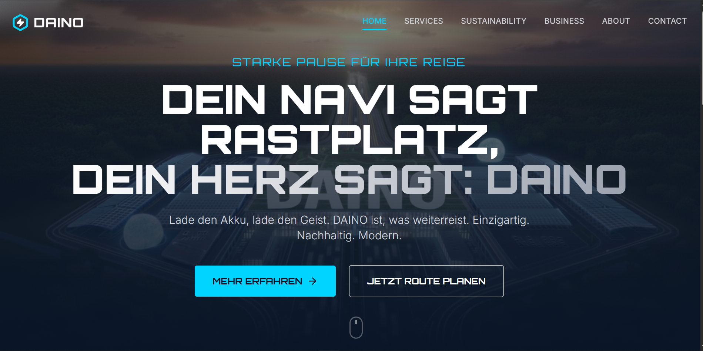
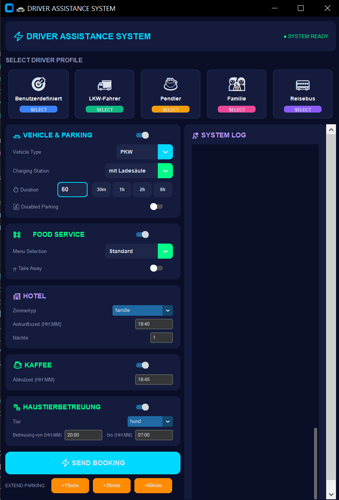

<!-- Improved compatibility of back to top link: See: https://github.com/othneildrew/Best-README-Template/pull/73 -->
<a name="readme-top"></a>

<!-- PROJECT LOGO -->
<br />
<div align="center">
  <a href="https://github.com/your_username/ems-rest-stop-agents">
    
  </a>

  <h3 align="center">🚗 EMS Rest-Stop Agents</h3>

  <p align="center">
    Intelligentes Multi-Agenten-System für Autobahn-Raststätten
    <br />
    Mit GUI, Voice Assistant und automatisierten Services
    <br />
    <a href="https://jandost-ahmad.github.io/ems-webseit/" target="_blank"><strong>🌐 Webseite besuchen »</strong></a>
    ·
    <a href="#getting-started"><strong>Jetzt starten »</strong></a>
    <br />
    <br />
    <a href="#features">Features</a>
    ·
    <a href="#installation">Installation</a>
    ·
    <a href="#usage">Verwendung</a>
    ·
    <a href="#architecture">Architektur</a>
  </p>
</div>

<!-- WEBSITE SCREENSHOT -->
<div align="center">
  <a href="https://jandost-ahmad.github.io/ems-webseit/" target="_blank">
    
  </a>
  <p><em><a href="https://jandost-ahmad.github.io/ems-webseit/" target="_blank">🌐 DAINO Webseite besuchen</a> - "Starke Pause für Ihre Reise"</em></p>
</div>

<!-- GUI SCREENSHOT -->
<div align="center">
  
  <p><em>Futuristische GUI für Fahrer-Assistenz</em></p>
</div>

---

## 📋 Inhaltsverzeichnis

- [Über das Projekt](#about-the-project)
- [Features](#features)
- [Voraussetzungen](#prerequisites)
- [Installation](#installation)
- [Verwendung](#usage)
- [Architektur](#architecture)
- [Agenten-Übersicht](#agent-overview)
- [Voice Assistant](#voice-assistant)
- [Troubleshooting](#troubleshooting)
- [Lizenz](#license)
- [Kontakt & Links](#kontakt--links)

---

<a name="about-the-project"></a>
## 🎯 Über das Projekt

**EMS Rest-Stop Agents** ist ein intelligentes Multi-Agenten-System für Autobahn-Raststätten, das Fahrern hilft, verschiedene Services zu buchen:

- 🚗 **Parkplatz-Reservierung** (PKW, LKW, Bus mit/ohne Ladesäule)
- 🍽️ **Essensbestellung** (Standard, Vegetarisch, Vegan, Glutenfrei)
- 🏨 **Hotel-Zimmerbuchung** (Einzel, Doppel, Familie)
- ☕ **Kaffee-Bestellung**
- 🐾 **Haustierbetreuung** (Hund, Katze)
- 🧥 **Garderobe-Service** (digitale/physische Token)

Das System bietet **zwei Interaktionsmöglichkeiten**:
1. **Futuristische GUI** mit CustomTkinter
2. **Voice Assistant** mit Sprachsteuerung (Whisper STT + Piper TTS)

---

<a name="features"></a>
## ✨ Features

- 🤖 **Multi-Agenten-Architektur** mit uAgents Framework
- 🎨 **Moderne GUI** mit CustomTkinter (Dark Theme)
- 🎤 **Voice Assistant** mit Wake-Word-Erkennung
- 🧠 **LLM-basierte Intent-Klassifikation** (Ollama)
- 📡 **Central Service** für Nachrichten-Routing
- ⚡ **Echtzeit-Kommunikation** zwischen Agenten
- 🔔 **Automatische Erinnerungen** für Reservierungen
- 📊 **Service-Status-Tracking**

---

<a name="prerequisites"></a>
## 📦 Voraussetzungen

### System-Anforderungen
- **Python 3.10+**
- **Windows/Linux/macOS**
- **Mikrofon** (für Voice Assistant)
- **Lautsprecher/Kopfhörer** (für Voice Assistant)

### Externe Tools (optional für Voice Assistant)
- **Ollama** (für LLM-Intent-Klassifikation)
  - Download: https://ollama.ai
  - Empfohlenes Modell: `gpt-oss:20b-cloud` oder `deepseek-v3.1:671b-cloud`
- **Piper TTS** (für Text-to-Speech)
  - Download: https://github.com/rhasspy/piper
  - Deutsch-Modell: `de_DE-thorsten-low.onnx`

---

<a name="installation"></a>
## 🚀 Installation

### 1. Repository klonen

```bash
git clone https://github.com/your_username/ems-rest-stop-agents.git
cd ems-rest-stop-agents
```

### 2. Virtuelles Environment erstellen

**Windows (PowerShell):**
```powershell
python -m venv .venv
.\.venv\Scripts\Activate.ps1
```

**Linux/macOS:**
```bash
python3 -m venv .venv
source .venv/bin/activate
```

### 3. Dependencies installieren

```bash
pip install --upgrade pip
pip install uagents
pip install customtkinter
pip install pillow

# Für Voice Assistant (optional):
pip install faster-whisper
pip install sounddevice
pip install soundfile
pip install numpy
pip install requests
```

### 4. Ollama einrichten (nur für Voice Assistant)

1. Ollama installieren: https://ollama.ai
2. Modell herunterladen:
```bash
ollama pull gpt-oss:20b-cloud
# oder
ollama pull deepseek-v3.1:671b-cloud
```

### 5. Piper TTS einrichten (nur für Voice Assistant)

1. Piper herunterladen: https://github.com/rhasspy/piper/releases
2. Deutsch-Modell herunterladen: `de_DE-thorsten-low.onnx`
3. In `Agent_Fahrer/piper_voices/` ablegen
4. Piper in PATH aufnehmen oder Pfad in `voice_assistant.py` anpassen

---

<a name="usage"></a>
## 🎮 Verwendung

### ⚠️ WICHTIG: Start-Reihenfolge

Die Agenten **müssen** in dieser Reihenfolge gestartet werden:

### Schritt 1: Central Service starten

```bash
python Agent_Services/Central_Services/service_central.py
```

**WICHTIG:** Kopiere die ausgegebene **Agent-Adresse** (z.B. `test-agent://agent1q...`)

### Schritt 2: Service-Agenten starten

**In separaten Terminal-Fenstern:**

```bash
# Parkplatz-Service
python Agent_Services/Buchung_Service/service_parkplatz.py

# Essensservice
python Agent_Services/Buchung_Service/service_essen.py

# Kaffee-Service
python Agent_Services/Buchung_Service/service_kaffee.py

# Hotel-Service
python Agent_Services/Buchung_Service/service_hotel.py

# Haustierbetreuung
python Agent_Services/Buchung_Service/service_haustierbetreuung.py

# Garderobe-Service
python Agent_Services/Garderobe_Service/service_garderobe.py
```

### Schritt 3: Client-Agenten starten

**Option A: GUI starten**

```bash
python Agent_Fahrer/fahrer_gui.py
```

**Option B: Voice Assistant starten**

```bash
python Agent_Fahrer/voice_assistant.py
```

---

### 🔧 Konfiguration

#### Central Service Adresse aktualisieren

Nach dem Start des Central Service musst du die Adresse in folgenden Dateien eintragen:

1. **`Agent_Fahrer/fahrer_gui.py`** (Zeile ~155):
```python
CENTRAL_SERVICE_ADDRESS = "test-agent://agent1q..."  # Hier eintragen
```

2. **`Agent_Fahrer/voice_assistant.py`** (Zeile ~96):
```python
CENTRAL_SERVICE_ADDRESS = "test-agent://agent1q..."  # Hier eintragen
```

---

<a name="architecture"></a>
## 🏗️ Architektur

```
┌─────────────────────────────────────────────────────────────┐
│                    CLIENT LAYER                             │
├─────────────────────────────────────────────────────────────┤
│                                                             │
│  ┌──────────────┐                    ┌──────────────┐       │
│  │  GUI Client  │                    │ Voice Client │       │
│  │  (Port 8003) │                    │  (Port 8002) │       │
│  └──────┬───────┘                    └──────┬───────┘       │
│         │                                    │              │
│         └──────────────┬─────────────────────┘              │
│                        │                                    │
│                        ▼                                    │
│              ┌──────────────────────┐                       │
│              │   Central Service    │                       │
│              │     (Port 8000)      │                       │
│              └──────────┬───────────┘                       │
└─────────────────────────┼───────────────────────────────────┘
                          │
                          ▼
┌─────────────────────────────────────────────────────────────┐
│                  SERVICE LAYER                              │
├─────────────────────────────────────────────────────────────┤
│                                                             │
│  ┌──────────┐  ┌──────────┐  ┌──────────┐  ┌──────────┐     │
│  │Parkplatz │  │  Essen   │  │  Kaffee  │  │  Hotel   │     │
│  │  :8001   │  │  :8007   │  │  :8008   │  │  :8009   │     │
│  └──────────┘  └──────────┘  └──────────┘  └──────────┘     │
│                                                             │
│  ┌──────────┐                    ┌──────────┐               │
│  │ Haustier │                    │ Garderobe│               │
│  │  :8010   │                    │  :8006   │               │
│  └──────────┘                    └──────────┘               │
│                                                             │
└─────────────────────────────────────────────────────────────┘
```

---

<a name="agent-overview"></a>
## 🤖 Agenten-Übersicht

| Agent | Port | Beschreibung |
|-------|------|--------------|
| **Central Service** | 8000 | Routet Nachrichten an die Services |
| **Parkplatz** | 8001 | Verwaltet Parkplatz-Reservierungen |
| **Voice Assistant** | 8002 | Sprachsteuerung für Fahrer |
| **Fahrer GUI** | 8003 | Grafische Benutzeroberfläche |
| **Garderobe** | 8006 | Verwaltet Garderobe-Abgabe/-Abholung |
| **Essensservice** | 8007 | Verwaltet Essensbestellungen |
| **Kaffee** | 8008 | Verwaltet Kaffee-Bestellungen |
| **Hotel** | 8009 | Verwaltet Hotel-Zimmerbuchungen |
| **Haustierbetreuung** | 8010 | Verwaltet Haustierbetreuung |

---

### 📋 Detaillierte Agent-Funktionen

#### 🚀 Central Service (Port 8000)
- **Funktion**: Zentrale Nachrichtenverteilung
- **Aufgaben**:
  - Empfängt Anfragen von GUI/Voice Clients
  - Routet Nachrichten an die entsprechenden Service-Agenten
  - Verwaltet Agent-Adressen und Service-Mapping
  - Konvertiert Nachrichten zwischen verschiedenen Modellen

#### 🚗 Parkplatz-Service (Port 8001)
- **Funktion**: Parkplatz-Reservierungssystem
- **Features**:
  - Unterstützt PKW, LKW, Bus
  - Ladesäulen-Verfügbarkeit
  - Behindertenparkplätze (2% der Kapazität)
  - Automatische Erinnerungen 5 Minuten vor Ablauf
  - Reservierungs-ID Tracking
  - Fallback-Mechanismen (z.B. 3× PKW → LKW)

#### 🎤 Voice Assistant (Port 8002)
- **Funktion**: Sprachgesteuerte Interaktion
- **Features**:
  - Wake-Word-Erkennung ("Hallo")
  - Speech-to-Text (Faster-Whisper)
  - LLM-basierte Intent-Klassifikation (Ollama)
  - Text-to-Speech (Piper TTS)
  - Asynchrone Nachrichtenverarbeitung

#### 🖥️ Fahrer GUI (Port 8003)
- **Funktion**: Grafische Benutzeroberfläche
- **Features**:
  - Futuristisches Dark Theme
  - Fahrer-Profile (LKW-Fahrer, Pendler, Familie, Reisebus)
  - Echtzeit-System-Log
  - Scrollbare Kontroll-Panels
  - Service-Enable/Disable Switches

#### 🧥 Garderobe-Service (Port 8006)
- **Funktion**: Garderobe-Verwaltung
- **Features**:
  - Artikel-Abgabe mit QR-Code-Generierung
  - Digitale oder physische Token
  - QR-Code-basierte Abholung
  - Max. 100 Schließfächer
  - Automatische Slot-Verwaltung

#### 🍽️ Essensservice (Port 8007)
- **Funktion**: Essensbestellungssystem
- **Features**:
  - Menü-Auswahl: Standard, Vegetarisch, Vegan, Glutenfrei
  - Öffnungszeiten: 08:00 - 20:00
  - Kapazitäts-Management (max. 60 Bestellungen/Stunde)
  - Zeitbasierte Verfügbarkeitsprüfung

#### ☕ Kaffee-Service (Port 8008)
- **Funktion**: Kaffee-Bestellungssystem
- **Features**:
  - Schnelle Bestellabwicklung
  - Automatische Berechnung der Abholzeit (+5 Minuten)
  - To-Go Unterstützung

#### 🏨 Hotel-Service (Port 8009)
- **Funktion**: Hotel-Zimmerbuchung
- **Features**:
  - Zimmerarten: Einzel, Doppel, Familie
  - Mehrnächtige Buchungen
  - Verfügbarkeits-Tracking
  - Automatische Kapazitätsverwaltung

#### 🐾 Haustierbetreuung (Port 8010)
- **Funktion**: Haustierbetreuungsservice
- **Features**:
  - Unterstützt Hunde (10 Plätze) und Katzen (20 Plätze)
  - Zeitbasierte Betreuung (von-bis)
  - Verfügbarkeitsprüfung
  - Automatische Kapazitätsverwaltung

---

<a name="voice-assistant"></a>
## 🎤 Voice Assistant

### Funktionsweise

1. **Wake Word**: Sage "Hallo" um den Assistant zu aktivieren
2. **Anfrage**: Sprich deine Anfrage (z.B. "Ich brauche einen PKW-Parkplatz mit Ladesäule")
3. **Verarbeitung**:
   - **STT**: Faster-Whisper transkribiert deine Sprache
   - **Intent-Klassifikation**: LLM (Ollama) erkennt die Absicht
   - **Nachricht**: Wird an Central Service gesendet
4. **Antwort**: Service-Antworten werden per TTS (Piper) vorgelesen

### Beispiel-Anfragen

- "Ich brauche einen PKW-Parkplatz mit Ladesäule für zwei Stunden"
- "Ich möchte ein veganes Essen zum Mitnehmen bestellen"
- "Reserviere mir bitte ein Einzelzimmer für zwei Nächte"
- "Ich brauche Kaffee to go"
- "Könnt ihr euch um meinen Hund kümmern?"

### Konfiguration

In `Agent_Fahrer/voice_assistant.py`:

```python
# Wake Word
WAKE_WORD = "Hallo"

# Ollama-Modell
model = "gpt-oss:20b-cloud"  # oder "deepseek-v3.1:671b-cloud"

# Piper TTS
PIPER_MODEL_PATH = "piper_voices/de_DE-thorsten-low.onnx"
```

---

<a name="troubleshooting"></a>
## 🔧 Troubleshooting

### Port bereits belegt

**Fehler:** `Address already in use`

**Lösung:** 
- Prüfe, welche Prozesse die Ports belegen
- Windows: `netstat -ano | findstr :8000`
- Linux: `lsof -i :8000`
- Beende den Prozess oder ändere den Port in der Konfiguration

### Central Service Adresse nicht gefunden

**Fehler:** `Failed to connect`

**Lösung:**
- Stelle sicher, dass Central Service läuft
- Kopiere die **exakte** Agent-Adresse aus der Ausgabe
- Aktualisiere `CENTRAL_SERVICE_ADDRESS` in GUI/Voice Assistant

### Voice Assistant hört nicht

**Lösung:**
- Prüfe Mikrofon-Berechtigungen
- Teste Mikrofon mit anderen Apps
- Prüfe `sounddevice` Installation: `python -c "import sounddevice; print(sounddevice.query_devices())"`

### Ollama-Verbindungsfehler

**Fehler:** `Connection refused` oder `Model not found`

**Lösung:**
- Stelle sicher, dass Ollama läuft: `ollama list`
- Prüfe Modell-Name in `intent_classifier.py`
- Teste Ollama-API: `curl http://localhost:11434/api/tags`

### Piper TTS funktioniert nicht

**Lösung:**
- Prüfe, ob Piper installiert ist: `piper --version`
- Prüfe Modell-Pfad in `voice_assistant.py`
- Stelle sicher, dass `piper_voices/` Ordner existiert

---

<a name="license"></a>
## 📄 Lizenz

Distributed under the MIT License. See `LICENSE.txt` for more information.

---

<a name="kontakt--links"></a>
## 👥 Kontakt & Links

**🌐 Webseite:** [https://jandost-ahmad.github.io/ems-webseit/](https://jandost-ahmad.github.io/ems-webseit/)

**📦 Projekt-Link:** [https://github.com/your_username/ems-rest-stop-agents](https://github.com/your_username/ems-rest-stop-agents)

---

<div align="center">

### ⚡ DAINO - Starke Pause für Ihre Reise

**Einzigartig. Nachhaltig. Modern.**

Made with ❤️ for better rest stops

[⬆️ Nach oben](#readme-top)

</div>
